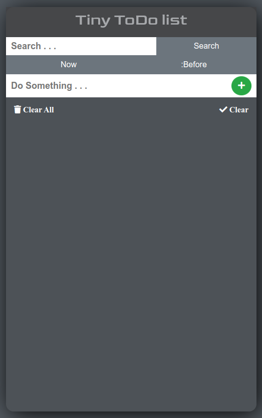
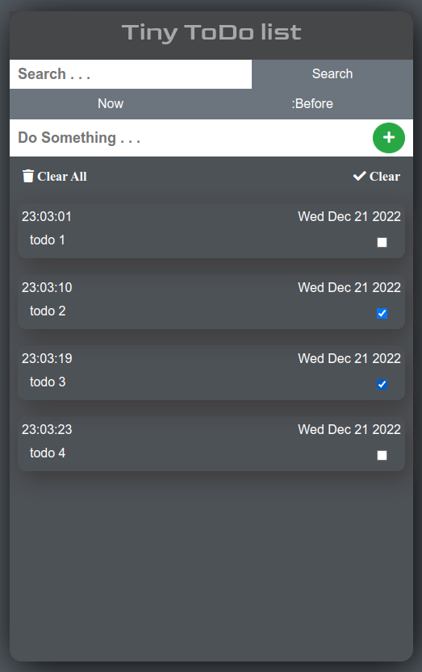
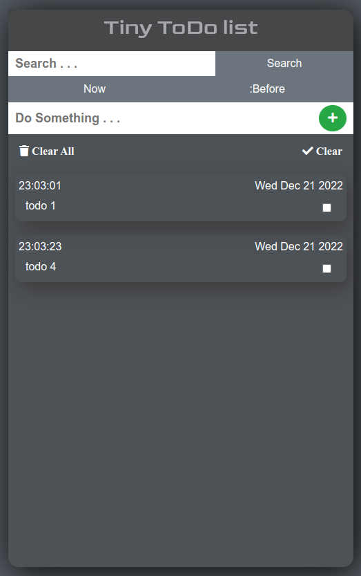

# Tiny todo list

I created a simple :spiral_notepad:[todo app](https://rahul0070050.github.io/ToDo/), this is a basic one actually i'm trying to add tole more features in it. The app can perform basic operations like adding and removing todo's also have multiple select option for removing for finished todo's. Now the app is in the development stage

### **The web site is built with**
* **HTML**
* **CSS**
* **JS**

<br />
<br />


<div align="center">
     
    &nbsp;&nbsp;&nbsp;&nbsp;&nbsp;&nbsp;&nbsp;&nbsp;
    &nbsp;&nbsp;&nbsp;&nbsp;&nbsp;&nbsp;&nbsp;&nbsp;
    &nbsp;&nbsp;&nbsp;&nbsp;&nbsp;&nbsp;&nbsp;&nbsp;
    
</div>
<br/>
<br/>
<div align="center">
     
</div>
<br/>
<br/>

## **Contribution**

### If you have any idea share with me
<br />

```bash
git clone https://github.com/Rahul0070050/ToDo
```
Go to the directory
```bash
cd ToDo
```

#### Create a new barcch for you changes the Do some changes

```bash
git branch <new_branch>

# commit and push

git push origin <new_branch> 

# make a pull request
```